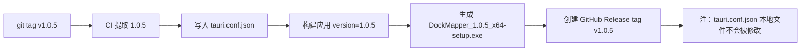
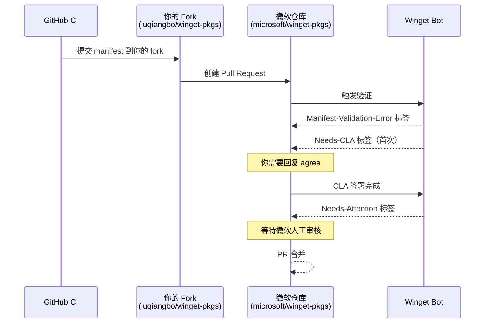

# Winget 发布完整实战记录

> 本记录涵盖了将 Tauri 2.0 应用发布到 GitHub Releases + Winget 的完整流程。
> 包含所有涉及文件的逐项说明、遇到的每个问题及其解决方式。
>
> 项目：DockMapper（Windows 任务栏工具）
> 技术栈：Tauri 2.0 + Rsbuild + React + NSIS 安装器
> 仓库：github.com/luqiangbo/dock-mapper

---

## 一、涉及的文件清单

| 文件 | 作用 | 关键程度 |
|------|------|---------|
| `src-tauri/tauri.conf.json` | Tauri 应用配置（版本号、打包格式、自动更新） | ★★★★★ |
| `.github/workflows/release.yml` | CI/CD 发布流水线 | ★★★★★ |
| `updater.json` | Tauri 自动更新的元数据文件 | ★★★☆☆ |
| `docs/winget-publish-guide.md` | 本文件 | ★★★☆☆ |

辅助概念：

| 概念 | 说明 |
|------|------|
| `github.token` / `GITHUB_TOKEN` | CI 运行时的内置 Token，自动生成，无需手动创建 |
| `secrets.WINGET_TOKEN` | 手动创建的 GitHub Personal Access Token，用于提交到微软仓库 |
| `latest.json` | `tauri-action` 自动生成的上传到 Release 的更新元数据 |
| Winget manifest YAML | 描述包信息、安装器位置、静默参数的配置文件 |

---

## 二、tauri.conf.json 逐项说明

文件位置：`src-tauri/tauri.conf.json`

### 关键字段详解

```jsonc
{
  "productName": "DockMapper",      // 应用名称，影响安装器文件名
  "version": "1.0.4",               // 版本号。CI 中会自动从 tag 覆盖此值
  "identifier": "com.luqiangbo.dockmapper",  // 包标识符，Winget 不直接使用，但影响签名

  "bundle": {
    "active": true,
    "targets": ["nsis"],             // ★ 只打包 NSIS（exe），不生成 MSI
                                     //   可选值："all" / "msi" / "nsis" / ["nsis"]
    "windows": {
      "nsis": {
        "installMode": "currentUser", // ★ 当前用户安装，无需管理员权限
                                      //   可选："currentUser" / "perMachine" / "both"
        "languages": ["SimpChinese"]  // NSIS 多语言安装器包含的语言
      }
    }
  },

  "plugins": {
    "updater": {
      "endpoints": [                  // ★ 自动更新检查地址
        "https://github.com/luqiangbo/dock-mapper/releases/latest/download/latest.json"
      ],
      "pubkey": "4D7PTz1J5JJLq6XnHju0JAfmDK4YG16uOY5EW0qzrlg=",
      "windows": {
        "installMode": "passive"      // 静默安装更新（用户无感知）
      }
    }
  }
}
```

### 版本号管理策略

**原则：git tag 就是版本号，CI 自动同步。**



- tag 格式：`v` + 语义化版本号（`v1.0.5`、`v2.0.0`）
- 版本号格式：`1.0.5`（不含 v）
- tag 和版本号必须一一对应
- 本地 `tauri.conf.json` 的 version 不管填什么，CI 都会覆盖

### 为什么不生成 MSI？

```
MSI 强制带语言后缀（如 DockMapper_1.0.4_x64_en-US.msi），
NSIS 是多语言合一（DockMapper_1.0.4_x64-setup.exe）。

Winget 提交时用 NSIS 更简洁，用户双击安装也更友好。
```

---

## 三、release.yml 逐项说明

文件位置：`.github/workflows/release.yml`

### 整体结构

```yaml
name: Release                       # 工作流名称
on:
  push:
    tags:
      - "v*"                        # 触发条件：推送 v 开头的 tag

permissions:
  contents: write                   # ★ 必需：GitHub Release 写权限

jobs:
  release:
    runs-on: windows-latest
    steps:
      - ... 13 个步骤依次执行
```

### Step 1：Checkout

```yaml
- name: Checkout
  uses: actions/checkout@v4
```

检出代码到 CI 运行环境。

### Step 2-4：环境准备

```yaml
- name: Setup Node.js
  uses: actions/setup-node@v4
  with:
    node-version: 22              # Node.js 版本

- name: Setup pnpm
  uses: pnpm/action-setup@v4
  with:
    version: latest

- name: Install frontend dependencies
  run: pnpm install
```

Tauri 前端构建需要 Node.js 环境。

### Step 5-6：Rust 环境

```yaml
- name: Setup Rust
  uses: dtolnay/rust-toolchain@stable
  with:
    targets: x86_64-pc-windows-msvc   # Windows x64 目标

- name: Cache Rust dependencies
  uses: swatinem/rust-cache@v2
  with:
    workspaces: src-tauri              # 缓存 src-tauri 目录下的 Cargo 编译产物
    key: windows-x86_64                # 缓存 key
```

Rust 编译缓存可以节省后续 CI 运行时间（约 5-10 分钟）。

### Step 7：自动同步版本号（★ 容易踩坑）

```yaml
- name: Sync version from tag
  shell: pwsh                       # ★ 必须用 pwsh（PowerShell Core），
                                    #    YAML 的缩进解析与 cmd 不同
  run: |
    $tag = "${{ github.ref_name }}"      # 获取 tag 名称：v1.0.5
    $version = $tag.TrimStart('v')       # 去掉 v：1.0.5
    $config = Get-Content src-tauri/tauri.conf.json -Raw | ConvertFrom-Json
    $config.version = $version           # 覆盖 version 字段
    $config | ConvertTo-Json -Depth 10 | Set-Content src-tauri/tauri.conf.json
```

**容易踩的坑**：

- `ConvertFrom-Json` 报错 → 检查 `tauri.conf.json` 是否是合法 JSON（尤其是逗号）
- `-Depth 10` 必加，否则嵌套对象会被截断
- 这个 step 必须在 `Build and publish` 之前

### Step 8：代码签名（可选）

```yaml
- name: Import Windows code signing certificate
  env:
    WINDOWS_CERTIFICATE: ${{ secrets.WINDOWS_CERTIFICATE || '' }}
    WINDOWS_CERTIFICATE_PASSWORD: ${{ secrets.WINDOWS_CERTIFICATE_PASSWORD || '' }}
  shell: pwsh
  run: |
    if (-not $env:WINDOWS_CERTIFICATE) {
      Write-Host "WINDOWS_CERTIFICATE not configured, skipping"
      exit 0                     # ★ 没有证书就跳过，不报错
    }
    # ... 导入证书步骤
```

**重点**：
- `${{ secrets.WINDOWS_CERTIFICATE || '' }}` — secret 不存在时不报错，而是变成空字符串
- 用 shell 脚本判断空字符串来决定是否跳过，**不能在 `if:` 里引用 secrets**

### Step 9：构建 + 发布到 GitHub Releases

```yaml
- name: Build and publish
  uses: tauri-apps/tauri-action@v1     # ★ 同一个 action 同时支持 Tauri v1 和 v2
  id: tauri_action
  env:
    GITHUB_TOKEN: ${{ secrets.GITHUB_TOKEN }}
    TAURI_SIGNING_PRIVATE_KEY: ${{ secrets.TAURI_SIGNING_PRIVATE_KEY }}
    TAURI_SIGNING_PRIVATE_KEY_PASSWORD: ""
  with:
    tagName: ${{ github.ref_name }}          # 用 tag 名作为 Release tag
    releaseName: "DockMapper ${{ github.ref_name }}"
    releaseDraft: false                       # 直接发布，不创建草稿
    prerelease: false
    args: --bundles nsis                      # ★ 只构建 NSIS 格式
    uploadUpdaterJson: true                   # ★ 自动生成 latest.json
    updaterJsonPreferNsis: true               # ★ 用 NSIS exe 做更新
    releaseBody: |                            # Release 的描述内容
      ## 一键安装
      ```powershell
      winget install luqiangbo.DockMapper
      ```
```

**参数详解**：

| 参数 | 作用 | 必填 |
|------|------|------|
| `tagName` | 创建的 git tag 名称 | 创建新 Release 时必填 |
| `releaseName` | Release 显示名称 | 创建新 Release 时必填 |
| `releaseDraft` | 是否创建草稿 | 个人项目=false |
| `args` | 传给 `tauri build` 的参数 | 推荐指定 `--bundles nsis` |
| `uploadUpdaterJson` | 自动上传 `latest.json` 到 Release assets | 用更新功能就开 |
| `updaterJsonPreferNsis` | 更新 JSON 中用 NSIS 路径 | true（exe 比 msi 友好） |

### Step 10-11：更新 updater.json（备用更新源）

```yaml
- name: Update updater.json on main branch
  uses: actions/checkout@v4
  with:
    ref: main
    path: main-branch

- name: Generate updater.json
  shell: pwsh
  env:
    TAG_NAME: ${{ github.ref_name }}
  run: |
    $tag = $env:TAG_NAME
    $version = $tag.TrimStart('v')
    $url = "https://github.com/luqiangbo/dock-mapper/releases/download/$tag/DockMapper_${version}_x64-setup.exe"
    $json = @{...} | ConvertTo-Json
    Set-Content -Path "main-branch/updater.json" -Value $json

- name: Commit updater.json
  continue-on-error: true
  shell: pwsh
  working-directory: main-branch
  run: |
    git config user.name "github-actions[bot]"
    git config user.email "github-actions[bot]@users.noreply.github.com"
    git add updater.json
    git diff --cached --quiet || git commit -m "chore: update updater.json [skip ci]"
    git push
```

**为什么需要这个？**

`tauri-action` 会自动上传 `latest.json` 到 Release assets，这是主要的更新源。但 `updater.json` 保留在 `main` 分支上作为**备用的更新 endpoint**。

### Step 12：提交 Winget manifest

```yaml
- name: Submit Winget manifest
  env:
    WINGET_TOKEN: ${{ secrets.WINGET_TOKEN || '' }}
    GH_TOKEN: ${{ github.token }}          # ★ 内置 token，无需创建
    TAG_NAME: ${{ github.ref_name }}
  shell: pwsh
  run: |
    # 1. 判断 token 是否配置
    if (-not $env:WINGET_TOKEN) {
      Write-Host "WINGET_TOKEN not configured, skipping Winget submission"
      exit 0
    }

    # 2. 从 GitHub Release 中获取 NSIS 安装器的下载 URL 和 SHA256
    $tag = $env:TAG_NAME
    $version = $tag.TrimStart('v')
    $release = gh release view $tag --json assets --jq '.assets[] | select(.name | endswith("_x64-setup.exe")) | {name: .name, url: .url}'
    $downloadUrl = ($release | ConvertFrom-Json).url
    $assetName = ($release | ConvertFrom-Json).name
    Invoke-WebRequest -Uri $downloadUrl -OutFile "$env:TEMP\$assetName"
    $hash = (Get-FileHash "$env:TEMP\$assetName" -Algorithm SHA256).Hash.ToUpper()

    # 3. 生成多文件 manifest（ManifestVersion 1.12.0）
    $manifestDir = "$env:TEMP\winget-manifest"
    New-Item -ItemType Directory -Path $manifestDir -Force | Out-Null
    $versionDir = "$manifestDir\$version"
    New-Item -ItemType Directory -Path $versionDir -Force | Out-Null
    $id = "luqiangbo.DockMapper"

    # version 清单
    Set-Content -Path "$versionDir\$id.yaml" -Value @"
PackageIdentifier: $id
PackageVersion: $version
DefaultLocale: zh-CN
ManifestType: version
ManifestVersion: 1.12.0
"@

    # installer 清单
    Set-Content -Path "$versionDir\$id.installer.yaml" -Value @"
PackageIdentifier: $id
PackageVersion: $version
Installers:
  - Architecture: x64
    InstallerType: nullsoft
    InstallerUrl: $downloadUrl
    InstallerSha256: $hash
    InstallerSwitches:
      Silent: /S
      SilentWithProgress: /S
ManifestType: installer
ManifestVersion: 1.12.0
"@

    # locale 清单
    Set-Content -Path "$versionDir\$id.locale.zh-CN.yaml" -Value @"
PackageIdentifier: $id
PackageVersion: $version
PackageLocale: zh-CN
Publisher: luqiangbo
PackageName: DockMapper
License: MIT License
ShortDescription: Windows taskbar widget and key mapping tool
ManifestType: defaultLocale
ManifestVersion: 1.12.0
"@

    # 4. 下载 wingetcreate.exe 并提交（传版本目录）
    $wcexe = "$env:TEMP\wingetcreate.exe"
    Invoke-WebRequest -Uri "https://github.com/microsoft/winget-create/releases/download/v1.12.13.0/wingetcreate.exe" -OutFile $wcexe
    & $wcexe submit --token $env:WINGET_TOKEN $versionDir
```

**这个步骤容易踩的坑最多，见后面的专题章节。**

---

## 四、Winget manifest 文件详解

### 什么是 Winget manifest？

一个 YAML 文件，描述了软件包的元数据和安装方式。
Winget 客户端通过读取这个文件来知道去哪里下载、如何静默安装。

### 文件结构（多文件清单）

> **注意**：winget 已弃用单文件 singleton 格式，必须使用多文件清单。
> 每个版本一个目录，包含三个 YAML 文件。

```
1.0.5/
├── luqiangbo.DockMapper.yaml               # version 清单
├── luqiangbo.DockMapper.installer.yaml      # installer 清单
└── luqiangbo.DockMapper.locale.zh-CN.yaml  # locale 清单
```

**version 清单** `luqiangbo.DockMapper.yaml`：

```yaml
PackageIdentifier: luqiangbo.DockMapper
PackageVersion: 1.0.5
DefaultLocale: zh-CN
ManifestType: version
ManifestVersion: 1.12.0
```

**installer 清单** `luqiangbo.DockMapper.installer.yaml`：

```yaml
PackageIdentifier: luqiangbo.DockMapper
PackageVersion: 1.0.5
Installers:
  - Architecture: x64
    InstallerType: nullsoft
    InstallerUrl: https://github.com/luqiangbo/dock-mapper/releases/download/v1.0.5/DockMapper_1.0.5_x64-setup.exe
    InstallerSha256: 4FFABE6922098AEDE166BA0972E810D5C0AB1C80B8FBFE220EC709FE2CC19EB5
    InstallerSwitches:
      Silent: /S
      SilentWithProgress: /S
ManifestType: installer
ManifestVersion: 1.12.0
```

**locale 清单** `luqiangbo.DockMapper.locale.zh-CN.yaml`：

```yaml
PackageIdentifier: luqiangbo.DockMapper
PackageVersion: 1.0.5
PackageLocale: zh-CN
Publisher: luqiangbo
PackageName: DockMapper
License: MIT License
ShortDescription: Windows taskbar widget and key mapping tool
ManifestType: defaultLocale
ManifestVersion: 1.12.0
```

### 字段详解

#### PackageIdentifier

```
格式：<发布者>.<包名>
示例：luqiangbo.DockMapper
```

- 全局唯一，一旦确定不能修改
- 用户用 `winget install <标识符>` 来安装
- 通常在 `wingetcreate new` 时交互式填写

#### ManifestVersion

```
推荐值：1.12.0
```

> **注意**：1.6.0 和 1.9.0 均已弃用，必须使用 1.12.0。

版本兼容性说明：

| 版本 | 说明 |
|------|------|
| 1.6.0 | ❌ 已弃用 |
| 1.9.0 | ❌ 已弃用 |
| 1.12.0 | ✅ 当前推荐，需要最新 wingetcreate |

#### InstallerType

```
NSIS 安装器 → nullsoft
MSI 安装器  → msi
便携 exe    → portable
```

Tauri 的 NSIS 安装器对应 `nullsoft`。

#### InstallerSha256

- 必须**大写**十六进制
- CI 中通过 `(Get-FileHash ...).Hash.ToUpper()` 获取

#### InstallerSwitches

```yaml
InstallerSwitches:
  Silent: /S              # winget install 静默安装
  SilentWithProgress: /S  # winget install 显示进度
```

Tauri 的 NSIS 安装器支持 `/S` 参数进行静默安装。

---

## 五、CI 中 Winget 提交的详细演化过程

这一章记录了 CI 中实现 Winget 自动提交从失败到成功的完整过程。

### 版本 1：直接用 submit 传参数（❌ 失败）

```powershell
wingetcreate submit --token $env:WINGET_TOKEN --urls $url --sha256 $hash
```

**错误信息**：
```
Option 'urls' is unknown. Option 'sha256' is unknown.
```

**原因**：`wingetcreate submit` 不接受这些参数，它们属于 `new` 命令。

### 版本 2：用 new 命令生成再提交（❌ 失败）

```powershell
wingetcreate new --out temp $url
wingetcreate submit --token $token temp
```

**原因**：`wingetcreate new` 是**交互式命令**，CI 环境无人应答，会卡住。

### 版本 3：自己生成 YAML + 用 winget 安装（❌ 失败）

**问题 1**：PowerShell 的 here-string 与 YAML 冲突

```powershell
# 这段 PowerShell 在 YAML 的 run: 块里无法正常解析
$yaml = @"
key: value
"@   # ← "@" 必须在行首，但 YAML 要求有缩进
```

**解决**：改用逐行写入

```powershell
Set-Content -Path file -Value "key1: val1"
Add-Content -Path file -Value "key2: val2"
```

**问题 2**：`winget install Microsoft.WingetCreate` 在 CI 环境中不可靠

**错误信息**：
```
winget: command not found
# 或
找不到可用的升级
```

**解决**：直接从 GitHub 下载 exe

```powershell
Invoke-WebRequest -Uri "https://github.com/microsoft/winget-create/releases/download/v1.12.13.0/wingetcreate.exe" -OutFile wingetcreate.exe
```

> **注意**：`latest/download/wingetcreate.zip` 返回 404，正确 URL 是带有版本号的 direct exe 链接。

### 最终版本（✅ 成功）

```powershell
# 1. 下载安装器
gh release view $tag --json assets | ... 提取 URL
Invoke-WebRequest -Uri $url -OutFile installer.exe
$hash = (Get-FileHash installer.exe).Hash.ToUpper()

# 2. 逐行写入 manifest
$f = "$env:TEMP\winget-manifest\1.0.5.yaml"
Set-Content -Path $f -Value "PackageIdentifier: luqiangbo.DockMapper"
Add-Content -Path $f -Value "PackageVersion: 1.0.5"
# ...（逐行写完所有字段）

# 3. 下载 wingetcreate.exe
Invoke-WebRequest -Uri "https://github.com/microsoft/winget-create/releases/download/v1.12.13.0/wingetcreate.exe" -OutFile wcexe.exe

# 4. 提交
& wcexe.exe submit --token $env:WINGET_TOKEN $f
```

---

## 六、tauri-action 的参数详解

```yaml
- uses: tauri-apps/tauri-action@v1
```

这个 action 同时支持 Tauri v1 和 v2，自动检测。

### 全部可用参数

| 参数 | 默认值 | 说明 |
|------|--------|------|
| `tagName` | 空 | 创建的 git tag 名称 |
| `releaseName` | 空 | Release 标题 |
| `releaseBody` | 空 | Release 描述 Markdown |
| `releaseDraft` | false | 是否创建 Draft Release |
| `prerelease` | false | 是否为预发布版 |
| `args` | 空 | 传给 `tauri build` 的额外参数 |
| `uploadUpdaterJson` | true | 是否上传 latest.json |
| `updaterJsonPreferNsis` | false | latest.json 是否优先用 NSIS |
| `projectPath` | `./` | tauri.conf.json 所在目录 |
| `tauriScript` | 自动检测 | tauri CLI 命令（如 `pnpm tauri`） |
| `releaseId` | 空 | 上传到已有 Release（而不是新建） |
| `releaseAssetNamePattern` | 空 | 自定义 Release 产物文件名 |

### 生成的产物

构建完成后，tauri-action 会自动：

1. 将安装器上传到 GitHub Release assets
2. 如果 `uploadUpdaterJson: true`，生成 `latest.json` 也上传到 Release assets
3. 创建或更新 Release

---

## 七、updater.json 与 latest.json 的区别

项目中存在两个更新元数据文件：

| 文件 | 生成方式 | 位置 | 用途 |
|------|---------|------|------|
| `latest.json` | `tauri-action` 自动生成 | GitHub Release assets | **主要更新源** |
| `updater.json` | CI 手动更新 | `main` 分支根目录 | **备用更新源** |

### tauri.conf.json 中的配置

```json
"endpoints": [
  "https://github.com/luqiangbo/dock-mapper/releases/latest/download/latest.json"
]
```

这个 URL 指向 Release assets 中的 `latest.json`，是最新的发布信息。

### 为什么保留 updater.json？

`updater.json` 在 `main` 分支上，如果 Release assets 的 `latest.json` 无法访问，可以切换到这个备用 endpoint。

---

## 八、Winget PR 审核流程详解

### 提交流程



### CLA 签署

在 PR 页面回复以下内容（只需一次，以后所有 PR 都不需要再签）：

```
@microsoft-github-policy-service agree
```

### 标签含义完整对照

| 标签 | 颜色 | 含义 | 谁触发 | 需要做什么 |
|------|------|------|--------|-----------|
| `Manifest-Validation-Error` | 🔴 红色 | manifest 验证失败 | 机器人 | 查看 Details 修复后重新提交 |
| `Needs-Attention` | 🔵 蓝色 | 等待微软核心团队审核 | 机器人 | 等待，无需操作 |
| `Needs-Author-Feedback` | 🟡 黄色 | 需要作者回复 | 机器人 | 查看评论并回复 |
| `Needs-CLA` | ⚪ 白色 | 未签署 CLA | 机器人 | 回复 agree |
| `Validation-Guide` | ⚪ 白色 | 收到验证指南 | 机器人 | 参考指南操作 |

### 首次提交 vs 后续更新

```
首次提交（例如 1.0.4）：
  提交 → 验证 → CLA 签署 → 人工审核 → 合并
                              ⏳ 1-3 天

后续更新（例如 1.0.5 → 1.0.6）：
  提交 → 验证 → 自动合并
               ⏳ 几小时
```

---

## 九、完整发版操作手册

### 发布新版本

```bash
# 一行命令
git tag v1.0.5 && git push origin v1.0.5
```

CI 自动完成：

1. 从 tag 提取版本号 `1.0.5`
2. 同步到 `tauri.conf.json`
3. 构建 NSIS 安装器 `DockMapper_1.0.5_x64-setup.exe`
4. 创建 GitHub Release
5. 上传 `latest.json`（自动更新用）
6. 更新 `updater.json` 到 main 分支
7. 提交 Winget PR

### 构建失败重试

```bash
# 1. 删除已创建的 Release
gh release delete v1.0.5

# 2. 删除 tag
git push --delete origin v1.0.5
git tag -d v1.0.5

# 3. 修 bug 后重新打 tag
git tag v1.0.5 && git push origin v1.0.5
```

### 所需 Secrets

去 GitHub 仓库的 `Settings → Secrets and variables → Actions` 配置：

| Secret 名称 | 说明 | 是否必需 |
|-------------|------|---------|
| `GITHUB_TOKEN` | 内置，无需配置 | ✅ 自动 |
| `TAURI_SIGNING_PRIVATE_KEY` | Tauri 更新签名私钥 | ✅ 自动更新必需 |
| `WINGET_TOKEN` | 用于提交 Winget 的 PAT | ❌ 可选（不配就跳过 Winget） |
| `WINDOWS_CERTIFICATE` | 代码签名证书 Base64 | ❌ 可选 |
| `WINDOWS_CERTIFICATE_PASSWORD` | 证书密码 | ❌ 可选 |

---

## 十、快速参考命令

```bash
# ─── 发布 ───
git tag v1.0.5 && git push origin v1.0.5

# ─── 重试（构建失败后）───
gh release delete v1.0.5
git push --delete origin v1.0.5
git tag -d v1.0.5
# fix bug...
git tag v1.0.5 && git push origin v1.0.5

# ─── 本地生成 Winget manifest ───
wingetcreate new --out ./winget-manifest "https://github.com/xxx/releases/download/v1.0.5/app.exe"

# ─── 本地提交 Winget ───
wingetcreate submit --token ghp_xxxx ./winget-manifest

# ─── Pull wingetcreate 最新版 ───
Invoke-WebRequest -Uri "https://github.com/microsoft/winget-create/releases/download/v1.12.13.0/wingetcreate.exe" -OutFile wingetcreate.exe
```
